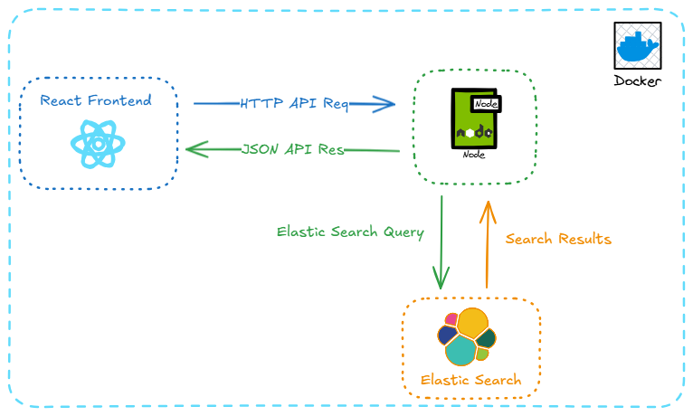

This is a full stack app that I've developed for my deeper understanding about geospatial search with Elasticsearch.

Pick any location in Ireland, and it instantly shows a list of products nearby. Products can be searched, filtered and sorted in real time. The app uses a dataset of 100,000 mock products generated using `Dataset_ElasticSearch.ipynb` included in the root directory. The generated data file `products_bulk.ndjson` is also included in the repository.

What it Does:

- Geospatial Search: Finds products within a certain set distance(radius) of any chosen location.
- Sorting: Sort results by relevance, distance, or by price.
- Infinite Scrolling: Implements infinite scrolling with an offset of 30 products.
- UI Feedback: Toast notifications show the number of products found in and around a selected location and how many products are loading on each API request.

Tech Stack:

The entire app runs on Docker containers.
- Frontend: React, Vite, Typescript, Redux, Tailwind.
- Backend: Node.js, Express, Typescript.
- Database & Infra: Elasticsearch, Docker, Deployed on EKS.

How To Run It Locally:

Step 1 - Clone the Repo:
- Clone the project
    - git clone https://github.com/Vijayanand-debug/Elastic-Geo-Search.git
    - cd Elastic-Geo-Search

Step 2 - Set Up Env Variables
- In the backend node-backend, create a .env file and add
    - ELASTICSEARCH_HOST=http://elasticsearch:9200

Step 3 - Set Up the Datbase and Generate the Product Data
- Follow the instructions from node-backend/elastic-search-cmd.md file

Step 4 - Start Docker Containers
- docker-compose up -d --build

### Data Source Credits
The project's geospatial data for Irish cities was taken from https://simplemaps.com/data/ie-cities

